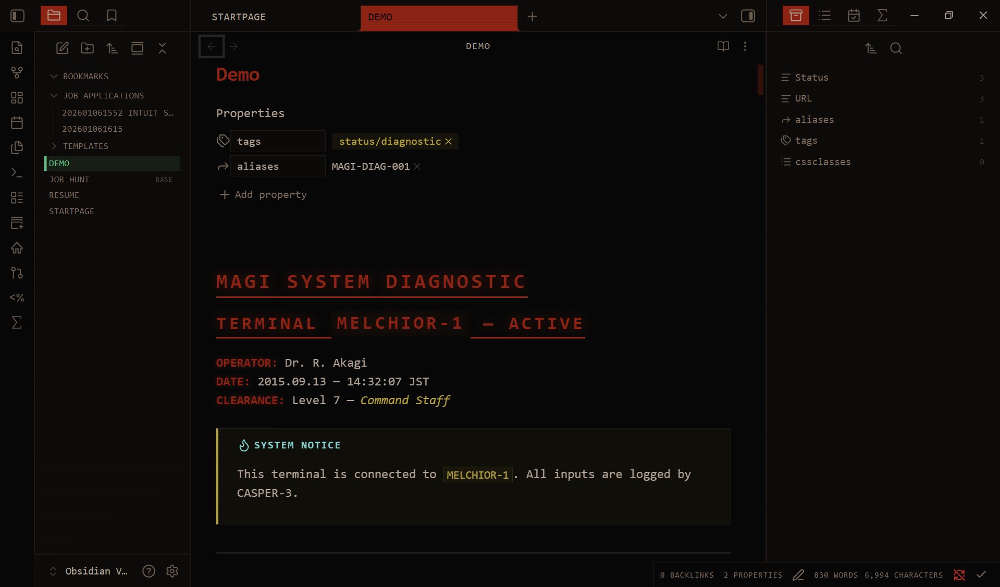
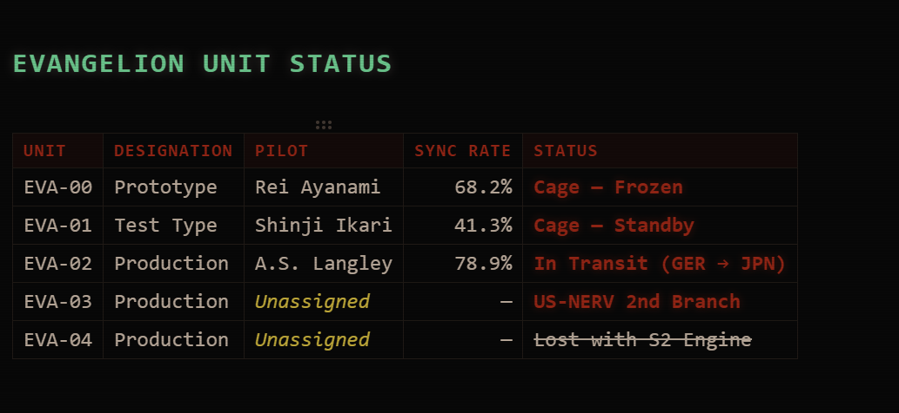
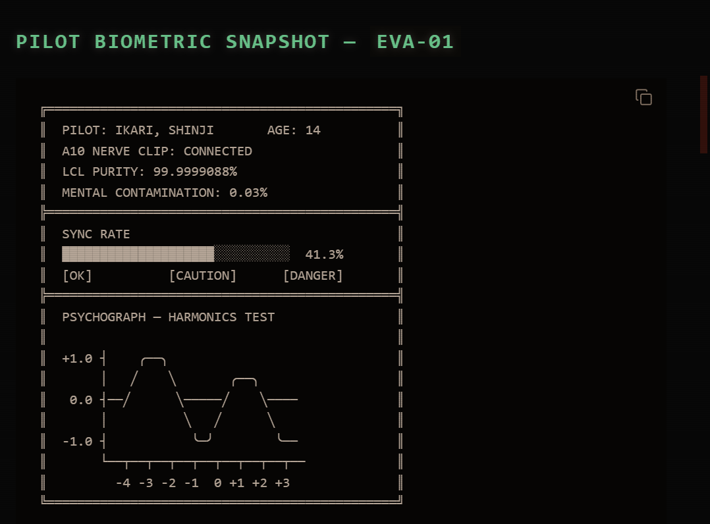
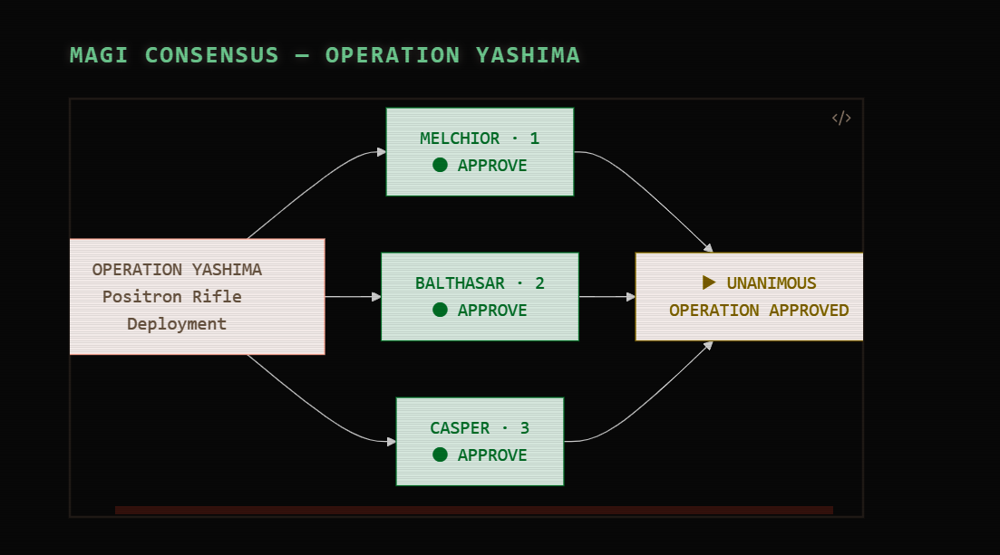
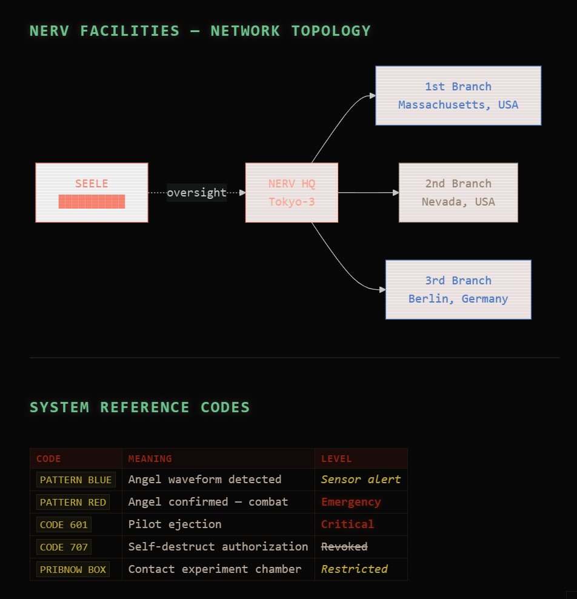

# NERV UI for Obsidian

An industrial brutalist command center interface for Obsidian, inspired by the MAGI and EVA-01 displays from _Neon Genesis Evangelion_.

## Gallery







## Local testing and development

To apply and test the NERV UI in your own Obsidian vault:

1. **Locate your vault's theme folder**:
    - In your vault, navigate to `.obsidian/themes/`.
2. **Set up the project**:
    - Clone or copy this repository into that folder: `.obsidian/themes/obsidian-nerv/`.
    - Alternatively, you can use a symlink (recommended for active development):
        ```bash
        # Windows (Command Prompt as Admin)
        mklink /D "C:\Path\To\Your\Vault\.obsidian\themes\obsidian-nerv" "c:\Users\ethan\Documents\GitHub\obsidian-nerv"
        ```
3. **Activate the theme**:
    - Open Obsidian **Settings > Appearance**.
    - Select **NERV UI** from the **Themes** dropdown.
    - Set **Base color scheme** to **Dark**.
4. **Development workflow**:
    - This project uses **Prettier** for formatting. Run `npm run format` after making changes.
    - Obsidian will automatically hot-reload your theme as you save `theme.css`.

## Operational tiers

### 1. Command center (global)

- **Aesthetic**: Pattern Blue accents and high-contrast countdowns.
- **CRT Simulation**: 2.5px pitch scanlines and RGB phosphor-bleed are applied globally.

### 2. Entry plug (tactical)

- **Trigger**: Tactical tags like `#alert/angel` shift the environment.
- **Alert Levels**:
    - **Pattern Blue (#alert/angel)**: High-level detection state.
    - **Pattern Red (#alert/terminal)**: Emergency state with a **10Hz industrial flicker**.

### 3. Magi (strategic)

- **Status Readouts**: Use monospaced JetBrains Mono for all diagnostic logs and UI labels.
- **Typography**: Matisse EB headers are mechanically compressed (`scaleX(0.85)`) to evoke the "urgency motif" of the original Tokyo-3 terminals.

## Tag-driven logic

Add the following tags to your note properties (YAML) to shift the UI state:

| Tag                  | State        | Visual Effect                |
| :------------------- | :----------- | :--------------------------- |
| `#alert/angel`       | Pattern Blue | Blue tint + Solid 3px border |
| `#alert/terminal`    | Pattern Red  | Red tint + **10Hz Flicker**  |
| `#status/diagnostic` | Monospaced   | High-density data layout     |

## Layout principles

- **Industrial Brutalism**: `border-radius` is set to `0px` across the entire application.
- **Data Saturation**: Padding and margins are minimal to simulate "The Burden of Knowledge."
- **Viewport Brackets**: Each workspace leaf is framed by HUD-style angular brackets.

## Developer setup (symlink)

To enable real-time synchronization between this repository and your Obsidian vault:

1. **Delete any existing `obsidian-nerv` folder** in your `.obsidian/themes/` directory.
2. **Open Command Prompt as Administrator**.
3. **Run the following command**:
    ```cmd
    mklink /D "C:\Path\To\Your\Vault\.obsidian\themes\obsidian-nerv" "c:\Users\user\Documents\GitHub\obsidian-nerv"
    ```
    _Replace `C:\Path\To\Your\Vault` with your actual Obsidian vault path._

---

## Adding your theme to the theme gallery

### Add a screenshot thumbnail

Inside the repository, include a screenshot thumbnail of your theme. You can name the file anything, for example `screenshot.png`. This image will be used for the small preview in the theme list.

Your screenshot file should be `16:9` aspect ratio.
The recommended size is 512x288.

### Submit your theme for review

To have your theme included in the Theme Gallery, you will need to submit a Pull Request to [`obsidianmd/obsidian-releases`](https://github.com/obsidianmd/obsidian-releases#community-theme).

## Releasing versions _(optional)_

If your theme is getting more and more complex, you might want to start thinking about how your theme will stay compatible with different versions of Obsidian. Introduced in v0.16 of Obsidian, themes support [Github Releases](https://docs.github.com/en/repositories/releasing-projects-on-github/managing-releases-in-a-repository). This means that you can specify which versions of your theme are compatible with which versions of Obsidian.

### Steps for releasing the initial version of your theme (1.0.0)

1. From your theme's repository, click on "Releases".


2. On the Releases page, there should be a button to **Draft a new Release**. Press it.


3. Fill out the Release information form.
    - **Choose a Tag**: Type in the name of the version number here. At the bottom of the dropdown should be a button to create a new tag with your latest theme changes. Choose this option.
      
    - **Release Title**: This can be the version number.
    - **Description** _Optional_: Anything that changed
    - **Files:** The most important part of this form is uploading the files. You can do this by dragging 'n dropping the `manifest.json` file and the `theme.css` file your for theme inside the file upload field.


4. Click "Publish Release."
5. Make sure that `versions.json` is set up correctly. This file is a map.

```json
{
	"1.0.0": "0.16.0"
}
```

This means that version 1.0.0 of your theme is compatible with version 0.16.0 of Obsidian. For the initial release of your theme, you shouldn't need to make any changes to this file.

### Steps for releasing new versions

Releasing a new version of your theme is the same as releasing the initial version.

1. From your theme's repository, click on "Releases."
2. On the Releases page, there should be a button to **Draft a new Release**. Press it.
3. Fill out the Release information form.
    - **Choose a Tag**: Type in the name of the version number here. At the bottom of the dropdown should be a button to create a new tag with your latest theme changes. Choose this option.
      
    - **Release Title**: This can be the version number.
    - **Description** _Optional_: Anything that changed
    - **Files:** The most important part of this form is uploading the files. You can do this by dragging 'n dropping the `manifest.json` file and the `theme.css` file your for theme inside the file upload field.

4. Click "Publish Release."
5. Update the `versions.json` file in your repository. For the initial release of your theme, you probably didn't need to make any changes to the `versions.json` file. When you release subsequent versions of your theme; however, it's best practice to include the new version as entry in the versions.json file. So this might look like:

```json
{
	"1.0.0": "0.16.0",
	"1.0.1": "0.16.0"
}
```

What's important to note here is: the new version is included as the "key" and the "value" is the minimum version of Obsidian that your theme compatible with. So if the new version of your theme is only compatible with an Insider version of Obsidian, it's important to set this value accordingly. This will prevent users on older versions of Obsidian from updating to the newer version of your theme.

## Citations and accreditation

This project is a non-commercial fan tribute to the visual world of _Neon Genesis Evangelion_.

### Official credits

- **Original Series & IP:** Created by **Hideaki Anno**.
- **Production Studios:** **Studio Gainax** (Original Series) and **Studio Khara** (Rebuild of Evangelion).
- **IP Management:** All rights and trademarks are managed by **Groundworks Co., Ltd.** on behalf of Studio Khara.

### Design inspiration

The visual language of this theme is a forensic reconstruction based on the **Fictional User Interface (FUI)** designs seen in the original 1995 series and the _Rebuild_ films. We acknowledge the groundbreaking work of the original GAINAX and Khara design teams who defined the "Narrative Friction" aesthetic.

### Community attribution

Special thanks to the **Evangelion fandom** and the contributors to resources like **EvaGeeks**, whose meticulous documentation of tech-readouts and UI frames made this reconstruction possible.

Special recognition goes to **Pedro Fleming** for his exceptional **FUI recreations**, which served as a vital reference for the technical accuracy and motion aesthetics of these NERV terminal screens.

---

_God's in his heaven. All's right with the world._
