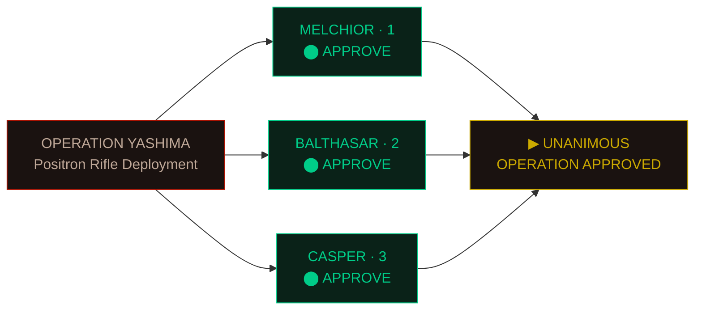
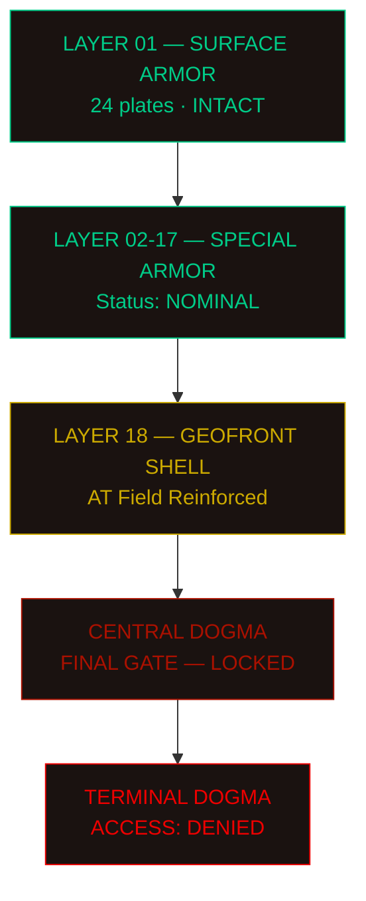
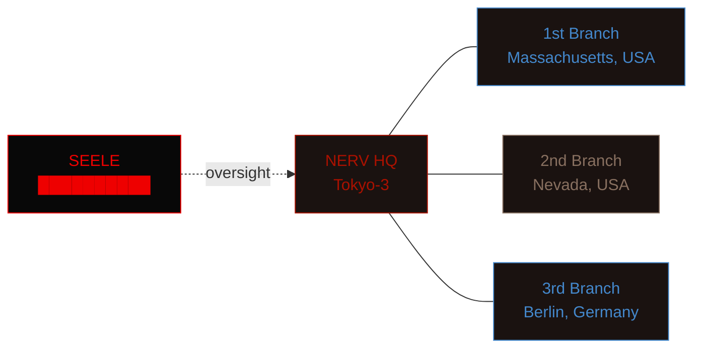

---
tags:
    - status/diagnostic
aliases:
    - MAGI-DIAG-001
---

# MAGI System Diagnostic

## Terminal `MELCHIOR-1` — Active

**OPERATOR:** Dr. R. Akagi **DATE:** 2015.09.13 — 14:32:07 JST **CLEARANCE:**
Level 7 — _Command Staff_

> [!important] System notice This terminal is connected to `MELCHIOR-1`. All
> inputs are logged by CASPER-3.

---

### Evangelion unit status

| Unit   | Designation | Pilot        | Sync Rate | Status                     |
| :----- | :---------- | :----------- | --------: | :------------------------- |
| EVA-00 | Prototype   | Rei Ayanami  |     68.2% | **Cage — Frozen**          |
| EVA-01 | Test Type   | Shinji Ikari |     41.3% | **Cage — Standby**         |
| EVA-02 | Production  | A.S. Langley |     78.9% | **In Transit (GER → JPN)** |
| EVA-03 | Production  | _Unassigned_ |         — | **US-NERV 2nd Branch**     |
| EVA-04 | Production  | _Unassigned_ |         — | ~~Lost with S2 Engine~~    |

---

### Pilot biometric snapshot — `EVA-01`

```
╔══════════════════════════════════════════════╗
║  PILOT: IKARI, SHINJI       AGE: 14          ║
║  A10 NERVE CLIP: CONNECTED                   ║
║  LCL PURITY: 99.9999088%                     ║
║  MENTAL CONTAMINATION: 0.03%                 ║
╠══════════════════════════════════════════════╣
║  SYNC RATE                                   ║
║  ████████████████████░░░░░░░░░░  41.3%       ║
║  [OK]          [CAUTION]      [DANGER]       ║
╠══════════════════════════════════════════════╣
║  PSYCHOGRAPH — HARMONICS TEST                ║
║                                              ║
║  +1.0 ┤    ╭──╮                              ║
║       │   ╱    ╲       ╭──╮                  ║
║   0.0 ┤──╱      ╲─────╱    ╲────             ║
║       │          ╲   ╱      ╲                ║
║  -1.0 ┤           ╰─╯        ╰──             ║
║       └──┬──┬──┬──┬──┬──┬──┬──┬──            ║
║         -4 -3 -2 -1  0 +1 +2 +3              ║![[Pasted image 20260313203155.png]]
╚══════════════════════════════════════════════╝
```

---

### MAGI consensus — Operation Yashima



---

### Geofront defense layers



---

### Active monitoring — Angel engagement log

> [!danger] 14:32:07 — Pattern Red Blood type: **BLUE**. Designation: _4th Angel
> — SHAMSHEL_. AT Field detected at perimeter line D-17.

> [!warning] 14:28:44 — Pilot alert Sync rate fluctuation detected in `EVA-01`.
> Recommend pilot assessment before deployment.

> [!info] 14:15:00 — Pattern Blue Anomalous waveform at bearing 270, distance
> 12km. MAGI probability of Angel: **99.998%**.

> [!note] 13:50:22 — Shift log B-shift handoff complete. All cage systems
> nominal. Umbilical bridges retracted.

> [!tip] Operator reminder Coolant pressure in cage 7 requires scheduled
> maintenance — file work order via `CASPER-3`.

> [!success] 12:00:00 — System check MAGI triple-redundancy self-test: **PASS**.
> All three cores in agreement.

> [!failure] 09:17:33 — Subsystem fault Sensor array grid `S-44` offline. Backup
> routing through `S-45` engaged.

---

### Launch checklist — EVA-01

- [x] Pilot insertion confirmed
- [x] Entry plug LCL flooded
- [x] A10 nerve connections nominal
- [x] Primary power — internal battery charged
- [ ] Umbilical cable route clearance
- [ ] Launch pad elevator lock released
- [ ] **Commander authorization received**

---

### Operational directives

1. All personnel must report to designated **battle stations** upon Pattern Red
   declaration
2. EVA pilots are to maintain minimum sync rate of _30%_ during standby
3. Unauthorized access to Terminal Dogma will result in immediate detention
    1. Section 2 enforcement protocol applies
    2. MAGI override requires unanimous consensus

---

### Classified — Project E internal memo

> "The Eva series are not simply weapons. They are born from Adam, and it is
> only through the bond with a human soul that they can be made to act. This is
> the cruel truth of our work." — _Dr. Yui Ikari, personal notes (CLASSIFIED —
> SEELE eyes only)_

> > _Annotation by Dr. R. Akagi:_ Mother's conscience lives inside CASPER. I know
> > this. I choose not to think about it.

---

### NERV facilities — network topology



---

### System reference codes

| Code           | Meaning                     | Level          |
| :------------- | :-------------------------- | :------------- |
| `PATTERN BLUE` | Angel waveform detected     | _Sensor alert_ |
| `PATTERN RED`  | Angel confirmed — combat    | **Emergency**  |
| `CODE 601`     | Pilot ejection              | **Critical**   |
| `CODE 707`     | Self-destruct authorization | ~~Revoked~~    |
| `PRIBNOW BOX`  | Contact experiment chamber  | _Restricted_   |

---

### Energy calculations — Positron rifle

$$P = \frac{E}{t} = \frac{1.21 \times 10^{15} \text{ J}}{0.003 \text{ s}} = 4.03 \times 10^{17} \text{ W}$$

> [!note] Power source Entire Japanese national grid routed through NERV
> transformers. Estimated brownout duration: _30 seconds_.

---

### End of diagnostic

```
┌──────────────────────────────────────┐
│  NERV — GOD'S IN HIS HEAVEN.         │
│  ALL'S RIGHT WITH THE WORLD.         │
│                                      │
│  SESSION CLOSED — 14:45:00 JST       │
│  TERMINAL: MELCHIOR-1                │
│  OPERATOR: AKAGI, R.                 │
└──────────────────────────────────────┘
```

---

_NERV Technical Department · Geofront · Tokyo-3_[^1]

[^1]:
    This document is classified under NERV Security Directive 7. Unauthorized
    distribution is a violation of the **Human Instrumentality Committee**
    charter.
